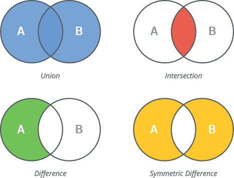

# Table of contents
- [String](#string)
- [Numeric](#numeric)
- [List](#list)
- [Set](#set)
- [Dict](#dict)
- [Tuple](#tuple)
- [To-do](#to-do)
- [Links](#links)


To-do
# String
## Basics
- Strings are [immutable](Glossary.md#immutable)
- Strings are [iterable](Glossary.md#iterable)
- Strings can be indexed (character can be accessed with bracket notation)
- Strings can be sliced

## Formating and f-strings
**.format()**  
print("My name is {}, I am {} years old.".format(name, age))

**f-strings (most common)**  
print(f"My name is {name}, I am {age} years old.")

## Commonly used methods
### Placeholder i guess - edit later
Example `text = " hello world "`
| Method           | Description                         | Example                |
|------------------|-------------------------------------|------------------------|
| **text.strip()** | remove leading and trailing spaces  | `"hello world"`        |
| **text.upper()** | convert to uppercase                | `"  HELLO WORLD  "`    |
| **text.lower()** | convert to lowercase                | `"  hello world  "`    |
| **text.replace("world", "Python")** | replace (by default all) occurences | `"  hello Python  "`    |
| **text.split()** | returns a list of the substrings in the string (by default whitespace separator)| `['hello', 'world']` |
| **"-".join(["a", "b", "c"])** | The string whose method is called is inserted in between each given string | `"a-b-c"`    |
| **text.count("l")** | returns the number of non-overlapping occurrences of substring  | `"3"`        |

### Searching in Strings
Example `text = "hello python"`
| Method           | Description                         | Example                |
|------------------|-------------------------------------|------------------------|
| **text.find("python")** | returns the lowest index where substring is found (-1 on failure)  | `6` |
| **text.startswith("he")** | returns True if string starts with the specified prefix (False otherwise)  | `True` |
| **text.endswith("on")** | returns True if string ends with the specified prefix (False otherwise)  | `True` |

Example `text = "hello python"`

| Membership test           | Description                         | Example                |
|------------------|-------------------------------------|------------------------|
| **"python" in text** | returns True if substring is part of string (False otherwise)  | `True` |


### Checks
| Method           | Description                         | Example                |
|------------------|-------------------------------------|------------------------|
| **"123".isdigit()** | returns True if the string is a digit string (False otherwise)  | `"True"`        |
| **"abc".isalpha()** | returns True if the string is a alphabetic string (False otherwise)  | `"True"`        |
| **"a2c".isalnum()** | returns True if the string is a alpha-numeric string (False otherwise)  | `"True"`        |

## Common problems / Tricks
1. Reverse a string (e.g palindrome)
2. Count vowels in string
3. Remove all spaces
4. [Count frequency for each character]
5. Find first non-repeated character
```python
# naive solution
def nonrepeated_char(string):

    dicc = {}

    for char in string:

        if char not in dicc:
            dicc[char] = 1

        elif char in dicc:
            dicc[char] += 1

    for key in dicc:
        if dicc[key] == 1:
            return key

    return -1

# optimized solution
def nonrepeated_char(string):

    for char in string:

        if string.count(char) == 1:

            return char

    return -1
```
6. Check if two string are anagrams
```python
def anagram(word_1, word_2):

    return sorted(word_1) == sorted(word_2)
```
7. Find longest word in sentence
```python
# naive solution
def longest_word(string):

    word_list = string.split()
    
    l_word = ""
    for word in word_list:

        if len(word) > len(l_word):
            l_word = word

    return l_word

# shorter solution
def longest_word(string):

    word_list = string.split()

    return max(word_list, key=len)
```

# Numeric
## Basics (int and float) 
- numeric types are [immutable](Glossary.md#immutable)
- `int` is a built-in data type for whole numbers.
- `float` is a built-in data type for numbers with a decimal point
- both can be positive, negative, or zero

## Arithmetic operations
`a / b` division (result will be float)  
`a // b` - floor division (result will be int)  
`a % b` - modulus / remainder  
`a ** b` - exponent

## Type conversion
Example `num_str = "123"`  
`int(num_str)`  
`float(num_str)`  
`int(3.9)` - it will be truncated to 3

## Useful build-in functions
| function         | Description                         | Example                |
|------------------|-------------------------------------|------------------------|
| **abs(-7)** | returns absolute value  | `"7"`        |
| **pow(2,3)** | returns power  | `"8"`        |
| **divmod(10,3)** | returns tuple (quotient & remainder)  | `"(3, 1)"`        |
| **max(4,9,2)** | returns biggest number  | `"9"`        |
| **min(4,9,2)** | returns smallest number  | `"29"`        |
| **round(3.75)** | returns rounded number  | `"4"`        |
| **round(3.75,1)** | returns number rounded to 1 decimal   | `"3.8"`        |

## Float precision
Floats can have precision issues because of binary representation.
```python
print(0.1 + 0.2)   # 0.30000000000000004

print(round(0.1 + 0.2,2))   # 0.3
```

So avoid direct comparision of floats due to precision issues
```python
a = 0.1 + 0.2
b = 0.3

print(round(a, 2) == round(b, 2))  # True
print(a == b) # False

```

## Boolean context
Integers can behave like a True/False

```python
if 5: # All numbers other than 0 -> True in if statement
    print("This runs") 
if 0: # 0 -> False in if statement
    print("This won't run")
```


## Common problems / Tricks
1. Check if number is odd or even
```python
def even_odd(num):

    if num % 2 == 0:
        return "even"

    return "odd"
```
2. Sum of digits in number
```python
def sum_of_digits(num):

    sum = 0
    string_num = str(num) 
    
    for n in string_num: 
        sum+=int(n) 

    return sum
```

3. Reverse a int
```python
def reverse_num(num):

    return int(str(num)[::-1])
```

4. Factorial of a number
5. Greates Common Divisor (build-in function exist but may be usefull + recursion)
6. Is number Armstrong number? (pierwsze slysze tbh)
7. Find all factors of a number
8. Is number a perfect number
9. fibonacci


# List
## Basics
- Lists are [mutable](Glossary.md#mutable)
- Lists are [iterable](Glossary.md#iterable)
- Lists can be indexed (element can be accessed with bracket notation)
- Lists can be sliced
- A list is an ordered (position matters) collection of items
- Items can be of any type: int, float, string, even other lists.

## Accessing Elements
```python
lst = [10, 20, 30, 40]
lst[0] # first element
lst[-1] # last element
lst[1:3] # [20, 30] (slicing)
lst[:2] # [10, 20]
lst[2:] # [30, 40] (from index 2 to end) 
```

## Modifying lists
```python
lst = [1, 2 ,3]

lst[0] = 10 # change first element [10, 2 ,3]
lst.append(4) # add to end [10, 2, 3, 4]
lst.insert(1, 15) # insert at index 1 [10, 15, 2, 3, 4]
lst.remove(2) # remove value 2 [10, 15, 3, 4]
lst.pop() # remove and return last element [10, 15, 3]
lst.pop(1) # remove and return element at index 1 [10, 3]
del lst[1] # remove element at index 1 [10]
```
`del` can remove slices


## Useful list methods/functions
```python
lst = [3, 1, 4, 2]

lst.sort() # [1, 2, 3, 4]
lst.sort(reverse=True) # [4, 3, 2, 1]
lst[::-1] # [2, 4, 1, 3]
lst.reverse() # [2, 4, 1, 3]

min(lst) # 1
max(lst) # 4
sum(lst) # 10
```
## Comprehension list
```python
lst = [1, 2, 3, 4, 5]

lst_even = [x for x in lst if x % 2 == 0] # [2, 4]

newlist_odd = [x for x in range(10) if x % 2 == 1] # [1, 3, 5, 7, 9]
```


## Common problems / Tricks
1. Sum all elements
```python
def list_sum(lst):

    return sum(lst)
```
2. Reverse a list
```python
def list_reverse(lst):

    return lst[::-1]
```
3. Remove duplicates
```python
def remove_duplicates(lst):

    return list(set(lst))
```
4. Create list B of even numbers from list A
```python
def even_list(lst):

    return [x for x in lst if x % 2 == 0]
```
5. Check if empty
```python
def is_empty(lst):

    if lst:
        return False
    
    return True
```
6. Count occurences of element
```python
def element_occurences(lst, value):

    return lst.count(value)
```
7. Find index of element
```python
def element_index(lst, value):

    # enumerate returns tuples of index and element
    for index, element in enumerate(lst): 
        if element == value:
            return index

    
# shorter solution
def element_index(lst, value):

    return lst.index(value)
```
8. Flatten a list (list of lists only) (single lvl)
```python
def flatten_list(lst):

    flattened_lst = []

    for element in lst:
        flattened_lst.extend(element)

    return flattened_lst
   
# list comprehension version 
def flatten_list(lst):

    return [element for sublist in lst for element in sublist]
```

9. Comprehension list: Square of numbers
```python
def square_lst(lst):

    return [x**2 for x in lst]
```

# Set
## Basics
- Sets are [mutable](Glossary.md#mutable)
- Sets are [iterable](Glossary.md#iterable)
- Sets can NOT be indexed (unordered)
- Sets can NOT be sliced (unordered)
- A set is an unordered collection of unique items
- Items can be only of a immutable type: numeric, string, tuples, frozensets.

## Modifying Set
```python
s = {1, 2, 3}

s.add(4)  # {1, 2, 3, 4}
s.add(1) # no change since 1 already exists in set
s.update([4,5]) # {1, 2, 3, 4, 5}
s.remove(2) # {1, 3, 4, 5} 
s.remove(2) # error, 2 not found
s.discard(3) # {1, 4, 5}
s.discard(3) # does not raise error when 3 not found
s.pop() # {1, 5} removes a random element and returns it, error if set empty
```

Example `s = {1, 2, 3}`  

| method         | Description                         | Example                |
|------------------|-------------------------------------|------------------------|
| **s.add((2, "7"))** | adds a single element to the set, no effect if the element is already present, can add hashable object e.g. tuple  | `"{1, 3, 4, (2, '7')}"`        |
| **s.update([5, 6])** | adds multiple elements from another iterable (list, tuple, set, string, etc.), loops through the iterable and add all its elements, no effect if the element is already present  | `"{1, 3, 4, 5, 6, (2, '7')}"`        |

## Set Operations
```python
a = {1, 2, 3}
b = {3, 4, 5}

a | b # {1, 2, 3, 4, 5} union
a & b # {3} intersection
a - b # {1, 2} difference
a ^ b # {1, 2, 4, 5} symmetric difference
```


## Useful Functions
```python
s = {1, 2, 3}

len(s) # 3
min(s) # 1
max(s) # 3
sum(s) # 6
sorted(s) # [1, 2, 3] returns sorted list
```
## Common problems / Tricks
1. Remove duplicates from a list
```python
def remove_duplicates(lst):
    
    return list(set(lst))
```
2. Find list of common elements between two lists
```python
def common_elements(lst_1, lst_2):
    
    return list(set(lst_1) & set(lst_2))
```
3. Find elements present in one list but not another
```python
```
4. Count unique words in a sentence
```python
```
5. Find duplicate elements in a list esing sets
```python
```

# Tuple
## Basics
- Tuples are [immutable](Glossary.md#immutable)
- Tuples are [iterable](Glossary.md#iterable)
- Tuples can be indexed
- Tuples can be sliced
- A tuple is an ordered, immutable collection of items
- Items can be of any type: int, float, string, list, etc.

## Tuple Methods (all non-magic methods)
```python
t = (1, [2,3], "nie")

t.count("nie") # 1
t.index(1) # 0 
```

## Common problems / Tricks
1. Unpack tuple of 3 elements into variables
```python
tooople = ("nie", [3,4,5], 6)

a, b, c = tooople
```
2. Nested tuple access ex. ```([1, 2], [3, 4])``` access 4
```python
toople = ([1, 2], [3, 4])
toople[1][1]
```
3. Check if element exists in tuple
```python
def element_in_tuple(krotka, value):

    if value in krotka:
        return True
    return False
```

# To-do
https://www.w3schools.com/python/exercise.asp?x=xrcise_datatypes1  
dict, frozenset
add *method* descriptions for sets and tuples
practice questions
args kwargs function

# Links
https://docs.python.org/3/tutorial/introduction.html  
https://docs.python.org/3/glossary.html  
https://docs.python.org/3/library/stdtypes.html#